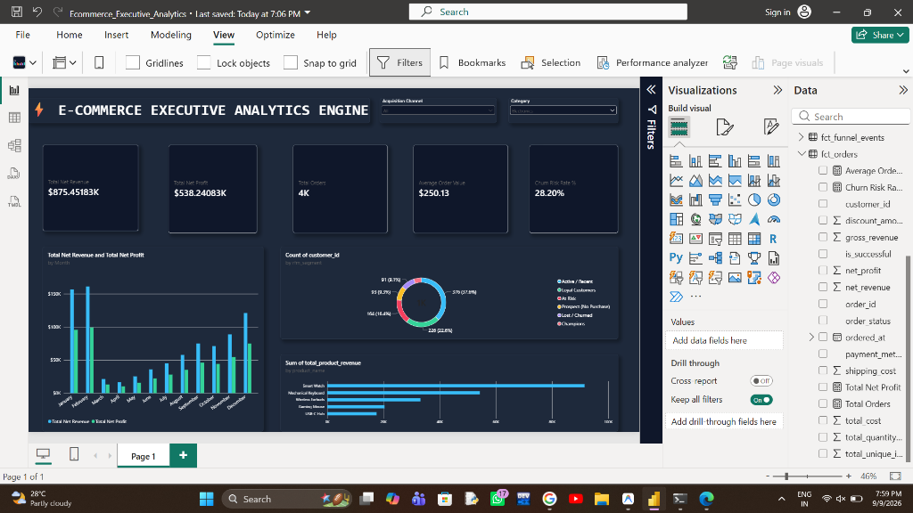

# 📊 Autonomous E-Commerce Analytics & AI Executive Insights Engine

[](https://ecommerce-analytics-engine.streamlit.app)
[](https://python.org)
[](https://getdbt.com)
[](https://duckdb.org)
[](https://powerbi.microsoft.com)

An end-to-end Modern Data Stack (MDS) platform built with **DuckDB**, **dbt**, **Streamlit**, **Power BI**, and **AI Automated Insights**.

---

## 📸 Executive Power BI Dark Mode Dashboard



---

## 🎯 Architecture & Data Flow

```
[ Raw Event Logs (CSV/JSON) ] 
            │
            ▼  (ingest_to_duckdb.py)
   [ DuckDB Warehouse ]  ── (raw schema)
            │
            ▼  (dbt run & dbt test)
   [ Dimensional Models ] ── (Staging & Marts Star Schema)
            │
            ├──────────────────────────────────────────┐
            ▼                                          ▼
[ Streamlit AI Web App ]                  [ Power BI Desktop Suite ]
  (Live Interactive BI + LLM Agent)          (DAX Measures + Dark Theme)
```

---

## 📊 Live Business Metrics Calculated

- **Total Net Revenue**: `$875,451.83`
- **Total Net Profit**: `$538,240.83`
- **Successful Completed Orders**: `2,337`
- **Average Order Value (AOV)**: `$250.13`
- **Customer Churn Risk Rate**: `28.20%` (164 At-Risk, 91 Churned)
- **Top Product Category**: `Electronics` ($217,118.61)

---

## 🚀 Key Features

1. **High-Performance Ingestion**: Ingests 15,000+ raw clickstream sessions (JSON) and orders/customers (CSV) into a local **DuckDB** analytical engine.
2. **Analytics Engineering with dbt**:
   - **Staging Layer**: Normalization, data type casting, and schema validation.
   - **Marts Layer**: Star Schema modeling containing `dim_customers` (RFM Cohorts & Churn Risk), `dim_products` (Margin & Velocity), `fct_orders` (Net Revenue & Profit), and `fct_funnel_events` (Device Conversion).
3. **Data Quality Governance**: Enforces 10 data quality tests (`dbt test`) covering `unique` and `not_null` assertions with **100% test pass rate**.
4. **Dual Reporting Suite**:
   - **Streamlit Web Application**: Interactive Python web app with Plotly charts and an **AI Natural Language Query Assistant**.
   - **Power BI Executive Dashboard**: Dark-mode executive dashboard with custom DAX measures and modern UI theme.

---

## 🛠️ Quickstart Instructions

```bash
# 1. Clone the repository
git clone https://github.com/sakshi-singh013/ecommerce-analytics-engine.git
cd ecommerce-analytics-engine

# 2. Set up virtual environment
python -m venv .venv
source .venv/bin/activate  # On Windows: .venv\Scripts\activate

# 3. Install dependencies
pip install -r requirements.txt

# 4. Generate raw synthetic datasets & ingest into DuckDB
python scripts/generate_raw_data.py
python scripts/ingest_to_duckdb.py

# 5. Run dbt models and data quality tests
cd dbt_project
dbt run --profiles-dir .
dbt test --profiles-dir .

# 6. Launch Streamlit Web Dashboard
cd ..
streamlit run app/dashboard.py
```

---

## 📁 Repository Structure

```
ecommerce-analytics-engine/
├── app/
│   ├── dashboard.py         # Streamlit Web Application
│   └── ai_agent.py          # AI Executive Insights & Natural Language SQL Agent
├── data/
│   ├── export/              # Exported dbt tables for Power BI
│   ├── raw/                 # Raw CSV/JSON datasets
│   └── warehouse.duckdb     # DuckDB Analytical Warehouse
├── dbt_project/
│   ├── models/              # Staging & Mart SQL models
│   ├── dbt_project.yml      # dbt Configuration
│   └── profiles.yml         # DuckDB Adapter profile
├── docs/
│   └── dashboard_preview.png # Executive Dashboard Screenshot
├── scripts/
│   ├── generate_raw_data.py # Synthetic event log generator
│   ├── ingest_to_duckdb.py  # DuckDB loader script
│   └── export_for_powerbi.py# CSV exporter for Power BI
├── high_contrast_dark_theme.json # Power BI Modern Dark Theme
├── requirements.txt         # Python dependencies
└── README.md                # Project documentation
```
